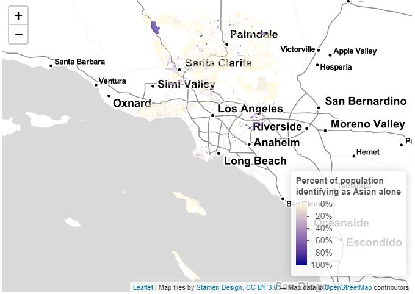
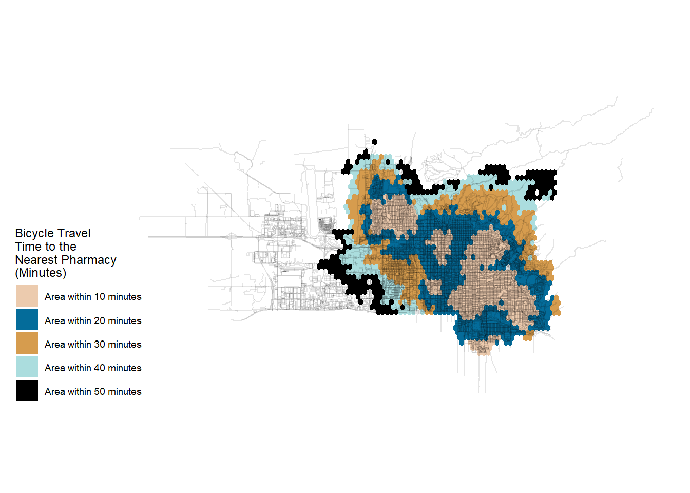
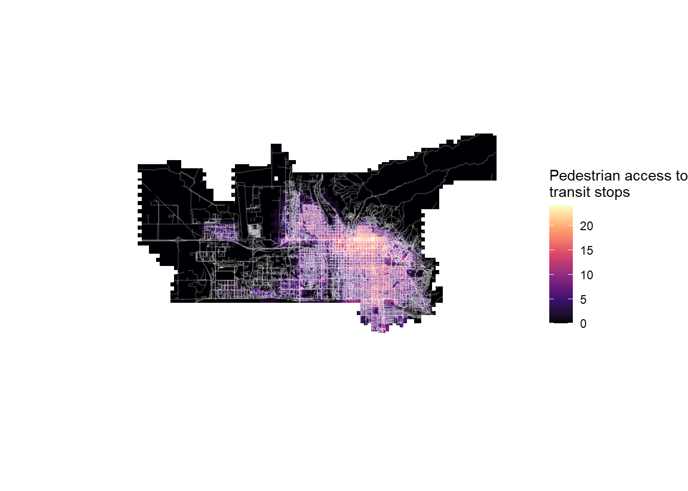
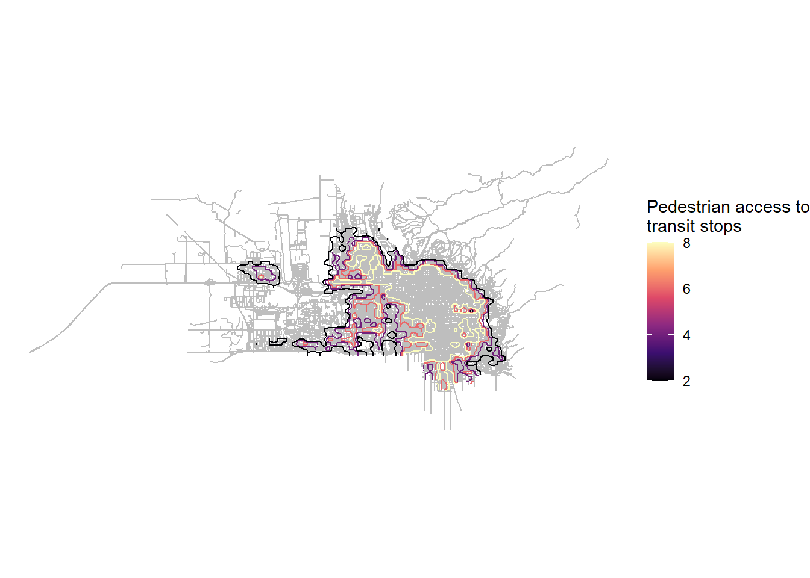
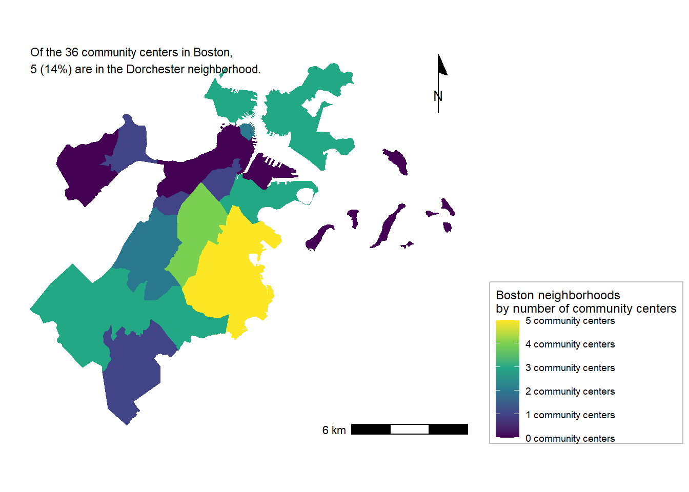
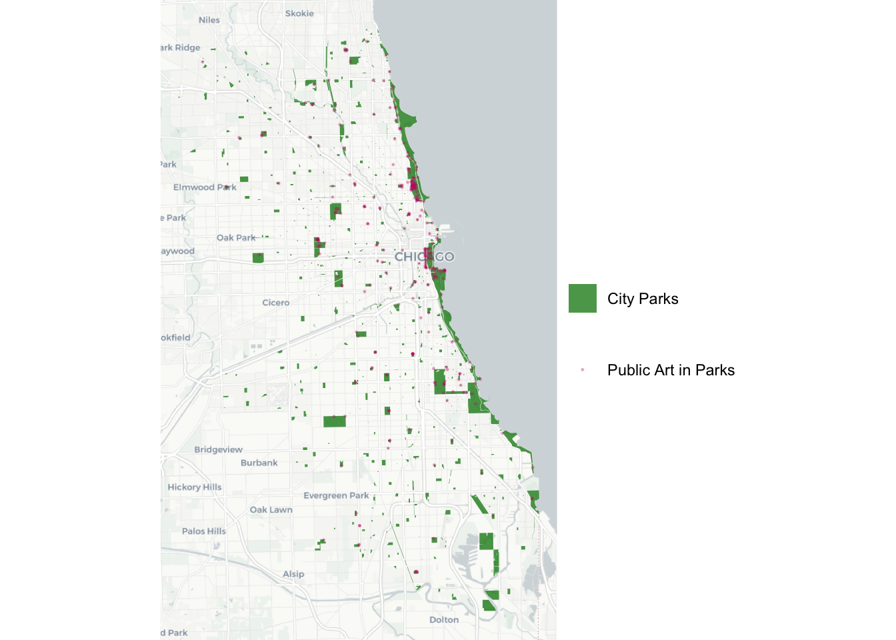
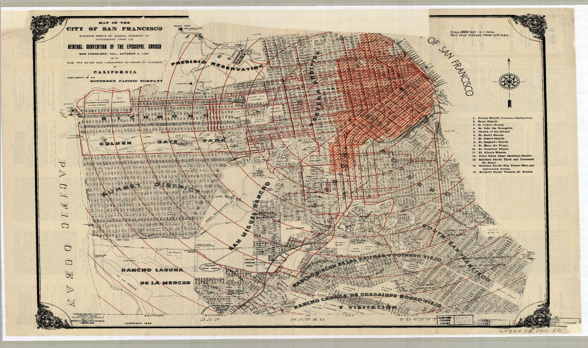

```{r setup, include=FALSE}
knitr::opts_chunk$set(echo = TRUE)
```

Over the course of the module, I have generated over 20 various maps through a number of different exercises and assignments. Throughout this course, I developed my ability to navigate a variety of unfamiliar datasets, while critically assessing data and improving my understanding of spatial phenomena at the regional, neighborhood and site scales. 

By working within teams on the majority of these assignments, I learned a lot of tricks and tips from my peers, which might be reflected below in some of my work. Some color schemes in these maps were inspired by my teammates, who taught me the techniques on how to make my maps more visually appealing. 


# Map of Los Angeles, California
This interactive map shows the percentage of Asian residents in each census block in Los Angeles County, California. This map is based on the data from the 2010 Decennial Census.

This interactive map demonstrates the following skills: 

* Displaying data on an interactive map

[](https://katia1602.github.io/FinalPortfolio/LA_Asian.html){target="_blank"}

# Maps of Salt Lake City, Utah 
The following three maps show access to pharmacies and transit stops in Salt Lake City, UT.  Although the Salt Lake Valley has historically been a very car-dependent area, the city has focused on improving networks for active modes of transport over the last few decades. I therefore decided to look at accessibility through the modes of  biking and walking.

## Bike Accessibility 
This map shows isochrones based on transit travel times by bike to the nearest pharmacy. 

This map demonstrates the following skills:

* Displaying multiple vector layers on the same map
* Calculating and displaying accessibility, based on travel time

[](https://katia1602.github.io/FinalPortfolio/PDF_Maps/Bicycle_Isochrones.pdf){target="_blank"}

## Pedestrian Accessibility
This map shows pedestrian accessibility based on a distance-decay function of the walking time to the nearest transit stop.

This map demonstrates the following skills:

* Displaying multiple vector layers on the same map
* Calculating and displaying accessibility, based on travel time
* Displaying raster data on a map

[](https://katia1602.github.io/FinalPortfolio/PDF_Maps/Raster_Map.pdf){target="_blank"}

## Contour Map
This map also shows pedestrian access to transit but was created slightly differently to the above map. I recreated the polygon layer on a square grid rather than a hexagonal grid and then made the polygon boundaries appear as countours.

This map demonstrates the following skills:

* Calculating and displaying accessibility, based on travel time
* Converting between raster layers and vector layers

[](https://katia1602.github.io/FinalPortfolio/PDF_Maps/Countour_Map.pdf){target="_blank"}

## Map of Boston, MA
This map shows the number of community centers, provided by the City of Boston and most recently updated in 2018, within each neighborhood. This map shows that there are between 0 and 5 centers in each neighborhood and that the greatest number of community centers are located in the Dorchester neighborhood.

This map demonstrates the following skills:

* Calculating and displaying relationships among point and polygon layers based on distance
* Aggregating point data to a layer of polygons

[](https://katia1602.github.io/FinalPortfolio/PDF_Maps/Boston_CC.pdf){target="_blank"}


## Map of Chicago, IL
This map shows the location of parks in Chicago and its surrounding areas. It also shows the location of public art within those parks.

This map demonstrates the following skills:

* Creating a map with three layers: A base map image, a layer of polygons, and layer of points

[](https://katia1602.github.io/FinalPortfolio/PDF_Maps/Park.pdf){target="_blank"}

## Map of San Francisco, CA
This is historic map of San Francisco from the early 20th century. It shows the damage to the city caused by the earthquake of 1906. 

This map demonstrates the following skills:

* Georeferencing a raster image

[](https://katia1602.github.io/portfolio/thumbnails/GEO_MAP_FIRE.JPG){target="_blank"}
